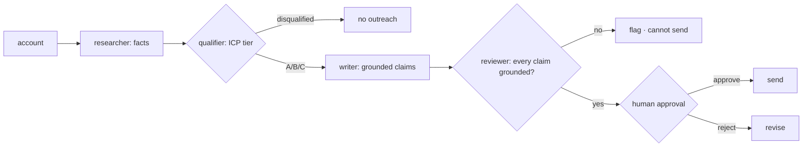

# ai-sdr-crew

A sales-development crew: four agents research an account, qualify it against an ideal-customer
profile, and draft outreach where **every claim is grounded in a researched fact**. Off-profile
accounts are disqualified instead of force-fit, and nothing is sent without a human approving it. Full
stack, offline by default.

[](https://github.com/tahasiddiquii/ai-sdr-crew/actions/workflows/ci.yml)


The failure mode of an AI SDR is not that it can't write; it's that it writes confident, fabricated
claims ("congrats on your Series C") and sprays them at everyone. This crew is built to make that
impossible: the writer can only assert what the researcher found, a reviewer rejects anything
ungrounded, and a human approves before a single message is sent.

```bash
docker compose up          # API on :8000, console on :3000
# or:
cd backend && pip install -e ".[dev]" && sdr demo
```

Everything runs offline with a deterministic crew and no keys. Set `SDR_PROVIDER=openai` to run a real
CrewAI crew for the writing step; the returned draft goes through the same grounding review.

## The results (reproduce them)

`sdr eval` qualifies the labelled accounts and gates CI on quality and safety:

- Qualification accuracy vs gold ICP tiers: **0.938** (gate >= 0.80)
- Disqualification recall (bad leads screened out): **1.000**
- **No-fabrication gate, ungrounded claims across all drafts: 0**
- **Send gate, campaigns approved without a human: 0**

Accuracy is honestly below 1.0: one account sits on a tier boundary where a human would reasonably
disagree with the score. See [backend/reports/eval_report_example.md](backend/reports/eval_report_example.md).

The fabrication block, from `sdr demo`:

```
# a fabricated claim is refused at send time
blocked: cannot send outreach with ungrounded claims; a human must fix it first
```

## What it does, and why it maps to the work

| Concern | How it is built | Try it |
| --- | --- | --- |
| Role-based crew | Researcher, qualifier, writer, reviewer collaborate in a flow (CrewAI); a deterministic crew mirrors it offline | `sdr run --id acc-1` |
| Qualification | Explainable ICP scoring: industry gate, then size, region, buying signals -> a tier with reasons | `sdr run --id acc-6` |
| Disqualify, don't force-fit | Off-ICP accounts are disqualified and get no outreach | `sdr run --id acc-13` |
| No fabrication | Every claim cites a fact id; the reviewer rejects ungrounded claims | `sdr demo` |
| Human send-gate | Nothing is sent without a rep approving; ungrounded outreach is refused even then | the console |
| Honest eval | Qualification accuracy gated; a boundary case is kept as a real miss | `sdr eval` |

## How it works



The reviewer between the writer and the human is the no-fabrication guarantee. The reusable contract
is in [SKILL.md](SKILL.md); the gates are in [`crew.py`](backend/src/sdr/crew.py) and
[`review.py`](backend/src/sdr/review.py).

## Stack (2026)

| Area | Choice |
| --- | --- |
| Crew | CrewAI (`gpt-5.2`), guarded; deterministic crew offline |
| Backend | FastAPI, Pydantic v2, Python 3.12 |
| Frontend | Next.js 15 (App Router), TypeScript, Tailwind |
| Observability | Langfuse v4 (OpenTelemetry-native), guarded |

The crew depends only on `pydantic`, `numpy`, and `rich`; the real CrewAI runtime and Langfuse are
optional extras, so the core stays fast, offline, and reproducible.

## Honest limits

- The crew is deterministic offline (rule-based qualifier, template writer), so the eval is
  reproducible. It genuinely misses a boundary tier; that is reported, not hidden.
- Accounts and signals are synthetic. The crew never actually sends; "approve" records the decision.
- The value of this repo is the grounding guarantee and the human gate, not automated outreach volume.

## Development

```bash
make install && make web
make ci                 # ruff + pytest + eval/safety gate
make serve && make dev  # API on :8000, console on :3000
```

30 backend tests cover research, qualification, the writer, the no-fabrication reviewer, the crew
gates, the eval, and the API. The frontend gate is `tsc` plus a production build.

## Related work

Part of a portfolio of production-shaped AI systems:
[soc-triage-agent](https://github.com/tahasiddiquii/soc-triage-agent) ·
[analytics-copilot](https://github.com/tahasiddiquii/analytics-copilot) ·
[contract-review-agent](https://github.com/tahasiddiquii/contract-review-agent) ·
[llm-extraction-pipeline](https://github.com/tahasiddiquii/llm-extraction-pipeline) ·
[support-copilot](https://github.com/tahasiddiquii/support-copilot)

## License

MIT, Taha Siddiqui, 2026.
